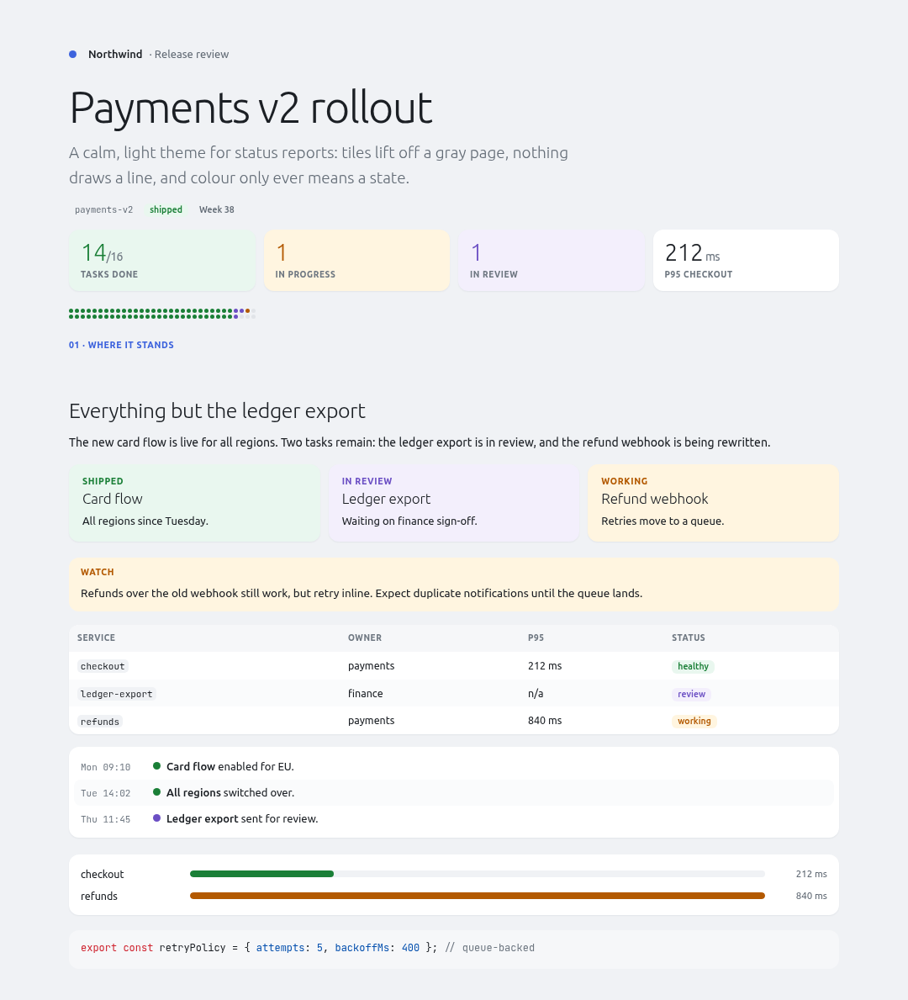

# poly-themes

Polyester themes. Each theme is a directory with its tokens, its CSS and an
example document.

## Install

```bash
poly theme add git@github.com:dkoch84/poly-themes.git
poly theme update          # pull changes later
poly theme list            # show the search path and where each theme resolved
```

Or point at a checkout:

```bash
POLY_THEME_PATH=/path/to/poly-themes poly build doc.poly --format pdf -o doc.pdf
```

---

## claude-artifact

For dense analytical reports: hairline rules, tabular numerals, one blue accent.

```
/page --pageless --margin 1.4cm --theme claude-artifact
```

Copy the markup you want from
[`themes/claude-artifact/example.poly`](themes/claude-artifact/example.poly),
which produces exactly this:


---

## focus

For status reports and writeups that should feel like a calm product UI: tiles
lift off a gray page with one soft shadow, nothing draws a line (no borders,
dividers or row rules), and colour only ever means a state: amber running,
purple in review, red failed, green done, blue for links. Ubuntu throughout,
Light at display size and never bold for names; JetBrains Mono for identifiers
only. Fonts ship in `fonts/` and are inlined, so builds need no network.

```
/page --pageless --width 1080px --theme focus
```



Building blocks, as raw HTML (see `themes/focus/example.poly` and the header of
`theme.css`): `.tile` (plus a state class), `.kicker`, `.stats > .stat`,
`.callout.<state>`, `.chip`, `.dot.<state>`, `.timeline > .ev`, `.bars > .bar`,
and `.dotbar`, a dense progress bar of dots. Put a section label right above
its heading with `<span class="kicker link sec-kicker">…</span>`.

