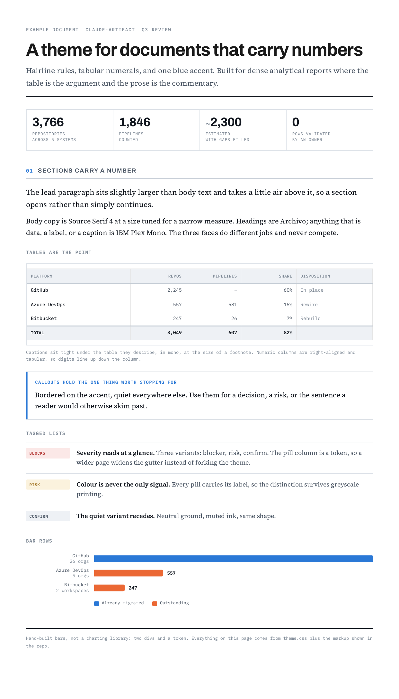

# poly-themes

Polyester themes. Each theme is a directory with its tokens, its CSS and an
example document.

## Install

```bash
poly theme add git@github.com:dkoch84/poly-themes.git
poly theme update          # pull changes later
poly theme list            # show the search path and where each theme resolved
```

Or point at a checkout:

```bash
POLY_THEME_PATH=/path/to/poly-themes poly build doc.poly --format pdf -o doc.pdf
```

---

## claude-artifact

For dense analytical reports: hairline rules, tabular numerals, one blue accent.

```
/page --pageless --margin 1.4cm --theme claude-artifact
```

Copy the markup you want from
[`themes/claude-artifact/example.poly`](themes/claude-artifact/example.poly),
which produces exactly this:


